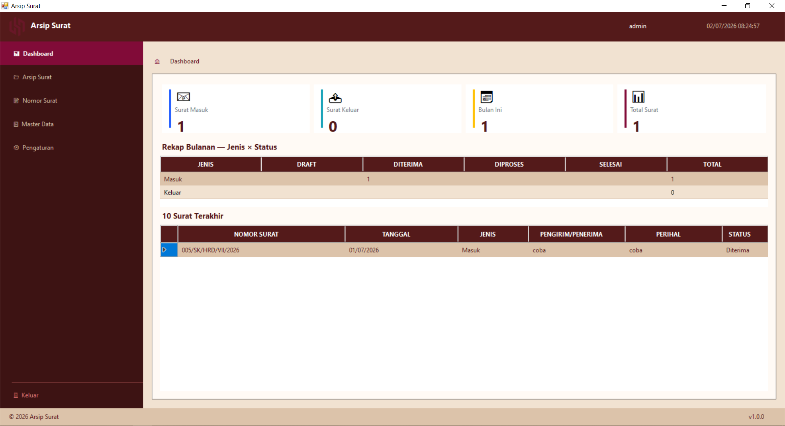
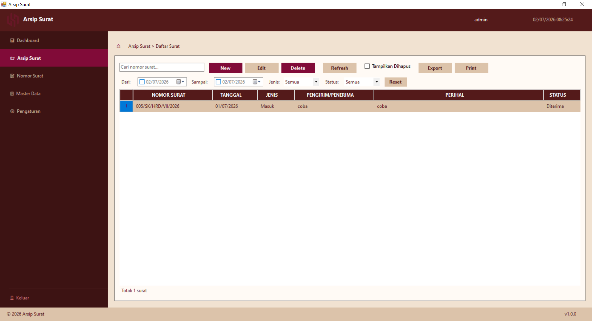
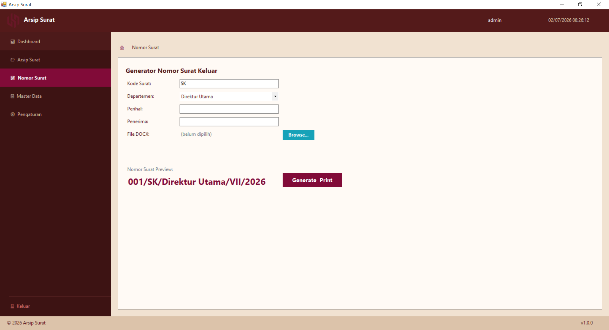
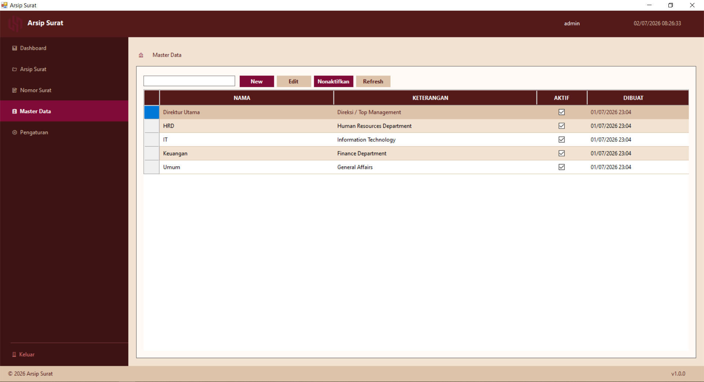
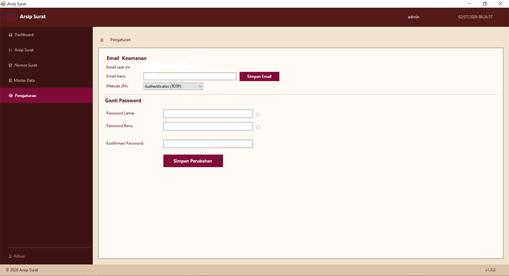
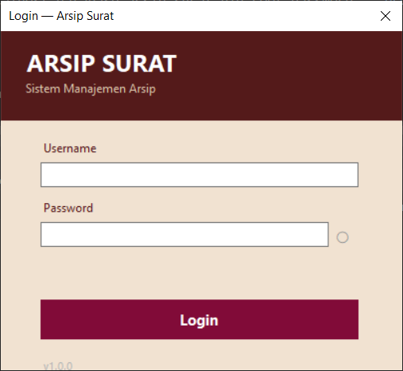
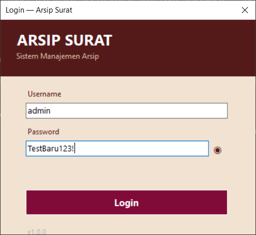
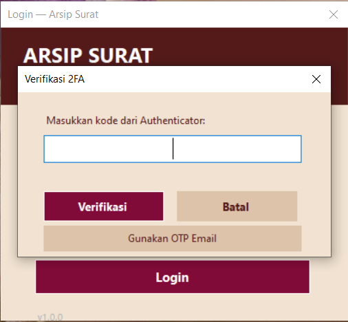

# Arsip Surat

Sistem manajemen arsip surat masuk dan keluar berbasis desktop untuk instansi/perusahaan. Aplikasi ini membantu staff tata usaha dan administrasi mengelola, mencari, dan melacak surat masuk/keluar secara digital — termasuk fitur OCR untuk ekstraksi data otomatis, generator nomor surat, konversi dokumen, serta keamanan autentikasi dua faktor.


---

## Daftar Isi

1. [Fitur Utama](#1-fitur-utama)
2. [Cara Kerja Aplikasi](#2-cara-kerja-aplikasi)
3. [Skenario Pengguna](#3-skenario-pengguna)
4. [Tech Stack & Library](#4-tech-stack--library)
5. [Struktur Database](#5-struktur-database)
6. [Cara Setup & Instalasi](#6-cara-setup--instalasi)
7. [Struktur Folder Project](#7-struktur-folder-project)
8. [Known Limitations & Catatan Pengembangan](#8-known-limitations--catatan-pengembangan)

---

## 1. Fitur Utama

### Dashboard

- 4 kartu statistik: Surat Masuk, Surat Keluar, Surat Bulan Ini, Total Arsip
- Tabel 10 surat terakhir
- Tabel ringkasan/rekap surat



### Arsip Surat

| Fitur | Keterangan |
|---|---|
| CRUD Surat | Tambah, edit, hapus surat masuk dan keluar |
| Pencarian | Pencarian keyword real-time (debounced 300ms) |
| Filter | Filter berdasarkan rentang tanggal, jenis surat (masuk/keluar), status |
| Soft Delete & Restore | Surat yang dihapus masuk ke "sampah" dan bisa dipulihkan |
| Permanent Delete | Hapus permanen dari sampah (tidak bisa dikembalikan) |
| Export CSV | Export daftar surat ke format CSV |
| Print Preview | Cetak daftar surat dengan preview |
| Upload Lampiran | Upload file PDF, JPG, JPEG, PNG (maks 10MB per file) |
| Preview Lampiran | Preview gambar/PDF langsung di form detail |
| OCR | Ekstraksi data otomatis dari dokumen yang di-scan (nomor surat, tanggal, perihal, jenis) dengan skor kepercayaan |



### Nomor Surat (Generator Otomatis)

| Fitur | Keterangan |
|---|---|
| Generate Nomor | Format: `{000}/{KODE}/{DEPT}/{BulanRomawi}/{Tahun}` — contoh: `003/SK/HRD/VII/2026` |
| Upload Template DOCX | Upload template surat dengan placeholder (contoh: `{{NOMOR_SURAT}}`) |
| Replace Placeholder | Placeholder di body, header, dan footer DOCX otomatis diganti dengan nomor yang di-generate |
| Konversi PDF | Konversi DOCX ke PDF otomatis via LibreOffice (jika terinstall) |
| Auto Save ke Arsip | Surat yang di-generate otomatis tercatat di Arsip Surat |
| Counter Atomik | Menggunakan `INSERT ... ON DUPLICATE KEY UPDATE` untuk mencegah duplikasi nomor dalam environment multi-user |



### Master Data — Departemen/Instansi

| Fitur | Keterangan |
|---|---|
| CRUD | Tambah, edit departemen/instansi |
| Aktif/Nonaktif | Toggle status aktif tanpa menghapus data |
| Validasi Unik | Nama departemen tidak boleh duplikat |
| Pencarian | Filter departemen berdasarkan keyword |



### Pengaturan

| Fitur | Status | Keterangan |
|---|---|---|
| Ganti Password | ✅ Selesai | Validasi password lama, indikator kekuatan password, konfirmasi password baru, verifikasi OTP via email |
| Email Keamanan | ✅ Selesai | Set email pertama kali langsung; perubahan email berikutnya perlu verifikasi OTP |
| 2FA Email OTP | ✅ Selesai | Kode OTP 6 digit dikirim ke email saat login |
| 2FA Authenticator (TOTP) | ✅ Selesai | Scan QR code di Google Authenticator/ Authy, verifikasi 6 digit kode, status "AKTIF" ditampilkan setelah aktivasi, tombol "Nonaktifkan 2FA" dengan konfirmasi |
| Show/Hide Password | ✅ Selesai | Tombol toggle visibilitas password (ikon ○ dan ◉) |



### Sistem Login & Keamanan

| Fitur | Keterangan |
|---|---|
| Autentikasi | Username + password dengan PBKDF2-SHA256 (100.000 iterasi, 16 byte salt) |
| 2FA Login | Jika TOTP aktif: input kode Authenticator; fallback ke Email OTP jika kode salah |
| Session | Session disimpan di memori (`CurrentSession`), hilang saat aplikasi ditutup |
| Logout | Tombol logout di sidebar bawah, kembali ke LoginForm |
| Proteksi Timing Attack | Perbandingan password menggunakan `SlowEquals` (constant-time comparison) |

---

## 2. Cara Kerja Aplikasi

### Alur Login → Dashboard

1. User membuka aplikasi → muncul `LoginForm`
2. User memasukkan username dan password
3. Sistem memverifikasi password menggunakan PBKDF2-SHA256
4. Jika 2FA TOTP aktif → muncul dialog input kode 6 digit
   - Kode salah → tombol "Gunakan OTP Email" sebagai fallback
   - Kode benar → lanjut ke Dashboard
5. Jika 2FA Email aktif → sistem mengirim OTP ke email → user memasukkan kode → lanjut ke Dashboard
6. Jika 2FA nonaktif → langsung ke Dashboard
7. Dashboard menampilkan statistik dan 10 surat terakhir

**Screenshot Login:**


*Form login dengan username dan password*


*Toggle show/hide password (tombol ◉)*


*Dialog verifikasi OTP setelah login (2FA Email/TOTP fallback)*

### Alur Input Surat Masuk Manual

1. Klik menu **Arsip Surat** di sidebar
2. Klik tombol **+ Baru** di toolbar
3. Form `SuratInputForm` terbuka — pilih jenis "Masuk"
4. Isi data: nomor surat, tanggal, pengirim, perihal, status, keterangan
5. (Opsional) Centang **OCR** → pilih file scan → sistem ekstraksi data otomatis → field terisi berdasarkan hasil OCR dengan skor kepercayaan (hijau ≥90%, kuning 70-89%, merah <70%)
6. (Opsional) Upload lampiran (PDF/JPG/PNG, maks 10MB)
7. Klik **Simpan** → data tersimpan di database, file di-copy ke folder `Arsip\YYYY\MM\`

### Alur Generate Nomor Surat Otomatis (Surat Keluar)

1. Klik menu **Nomor Surat** di sidebar
2. Isi: Kode Surat (contoh: `SK`), Pilih Departemen (dropdown), Perihal, Penerima
3. Klik **Preview** → melihat format nomor yang akan di-generate (contoh: `001/SK/HRD/VII/2026`)
4. Upload template DOCX (dengan placeholder `{{NOMOR_SURAT}}` atau placeholder lain)
5. Klik **Generate** → sistem:
   - Meng-generate nomor secara atomik (counter bertambah 1)
   - Mengganti placeholder di DOCX (body, header, footer) dengan nomor surat
   - Mengkonversi DOCX ke PDF via LibreOffice (jika terinstall; jika tidak, DOCX tetap tersimpan)
   - Menyimpan surat ke database dan arsip
   - Membuka file hasil secara otomatis

### Alur Aktivasi 2FA TOTP

1. Buka menu **Pengaturan** → bagian **Metode 2FA**
2. Pilih **Authenticator (TOTP)** dari dropdown
3. QR code dan Secret Key ditampilkan
4. Buka Google Authenticator / Authy → scan QR code (atau masukkan secret key manual)
5. Masukkan kode 6 digit dari aplikasi Authenticator ke field **Kode verifikasi**
6. Klik **Aktifkan** → sistem memverifikasi kode
7. Jika berhasil → form setup disembunyikan, status **✓ Autentikasi 2 Faktor (TOTP) sudah AKTIF** ditampilkan dengan tombol **Nonaktifkan 2FA**
8. Saat halaman Pengaturan dibuka kembali, status "AKTIF" langsung tampil (tidak perlu setup ulang)

---

## 3. Skenario Pengguna

> **Use Case 1:** Sebagai staff tata usaha, saya ingin mengarsipkan surat masuk secara digital sehingga surat mudah dicari dan tidak hilang.

> **Use Case 2:** Sebagai admin, saya ingin generate nomor surat keluar secara otomatis sehingga tidak terjadi duplikasi nomor dan format konsisten.

> **Use Case 3:** Sebagai pengelola arsip, saya ingin mencari surat berdasarkan tanggal, jenis, atau keyword sehingga menemukan dokumen yang dibutuhkan dalam hitungan detik.

> **Use Case 4:** Sebagai administrator sistem, saya ingin mengaktifkan autentikasi dua faktor (2FA) sehingga akun terlindungi meskipun password bocor.

> **Use Case 5:** Sebagai supervisor, saya ingin melihat statistik dan rekap surat di dashboard sehingga dapat memantau volume korespondensi harian/bulanan.

---

## 4. Tech Stack & Library

| Kategori | Teknologi/Library | Versi | Kegunaan |
|---|---|---|---|
| Framework | .NET Framework | 4.5.2 | Target framework aplikasi |
| IDE | Visual Studio | 2015 | Development environment |
| UI Framework | Windows Forms | - | GUI desktop application |
| Database Engine | MySQL | - | Database server |
| DB Driver | MySql.Data (Connector/Net) | 6.5.4 | Koneksi ke MySQL dari .NET |
| Password Hashing | PBKDF2-SHA256 (`Rfc2898DeriveBytes`) | Built-in | Hashing password (100.000 iterasi, 16 byte salt) |
| TOTP | Custom HMAC-SHA1 (RFC 6238) | Built-in | Generate dan verifikasi kode TOTP |
| QR Code | QRCoder | 1.4.3 | Generate QR code untuk setup TOTP |
| OCR | Tesseract | 3.3.0 | Ekstraksi teks dari dokumen scan (bahasa Indonesia + Inggris) |
| Dokumen DOCX | System.IO.Packaging | Built-in | Manipulasi file DOCX (replace placeholder) |
| Konversi PDF | LibreOffice | - | Konversi DOCX ke PDF via command line |
| Email (SMTP) | System.Net.Mail | Built-in | Kirim OTP via email |
| Scanner | WIA 2.0 (COM Interop) | Built-in Windows | Akses scanner dokumen |
| Export | System.Text.StringBuilder | Built-in | Generate CSV export |
| Print | System.Drawing.Printing | Built-in | Print preview dan cetak |

**Catatan dependency eksternal:**

| Dependency | Wajib? | Keterangan |
|---|---|---|
| MySQL Server | ✅ Ya | Database server, harus diinstall dan running |
| MySQL Connector Net 6.5.4 | ✅ Ya | Driver koneksi, install dari [MySQL Downloads](https://dev.mysql.com/downloads/connector/net/) |
| LibreOffice | Opsional | Untuk konversi DOCX → PDF. Jika tidak ada, DOCX tetap tersimpan tapi PDF tidak di-generate. Cek path: `C:\Program Files\LibreOffice\program\soffice.exe` atau `C:\Program Files (x86)\LibreOffice\program\soffice.exe` |
| Tesseract trained data | ✅ Ya (untuk OCR) | File `ind.traineddata` dan `eng.traineddata` harus ada di folder `tessdata\` di direktori aplikasi |
| Scanner WIA | Opsional | Hanya untuk fitur scan dokumen. Perlu scanner fisik yang mendukung WIA 2.0 + driver terinstall |

---

## 5. Struktur Database

Database `arsip_surat` dibuat otomatis saat pertama kali aplikasi dijalankan. Tidak perlu menjalankan migrasi manual.

### Diagram Relasi

```
┌──────────────────┐       ┌──────────────────────┐
│      users       │       │  master_departemen    │
├──────────────────┤       ├──────────────────────┤
│ id (PK)          │       │ id (PK)              │
│ username (UNIQUE) │       │ nama                 │
│ password_hash    │       │ keterangan           │
│ email            │       │ is_active            │
│ email_set        │       │ created_at           │
│ two_factor_method│       └──────────────────────┘
│ two_factor_secret│
│ created_at       │       ┌──────────────────────┐
│ last_login_at    │       │ nomor_surat_counter  │
│ is_active        │       ├──────────────────────┤
└──────────────────┘       │ id (PK)              │
                           │ tahun                │
                           │ kode_surat           │
┌──────────────────┐       │ last_number          │
│      surat       │       │ UNIQUE(tahun,kode)   │
├──────────────────┤       └──────────────────────┘
│ id (PK)          │
│ nomor_surat (UNIQUE) │   ┌──────────────────────┐
│ tanggal_surat    │       │     lampiran         │
│ jenis_surat      │       ├──────────────────────┤
│ pengirim         │       │ id (PK)              │
│ penerima         │       │ surat_id (FK) ───────┼──┐
│ perihal          │◄──────│ nama_file            │  │
│ status           │       │ file_path            │  │
│ keterangan       │       │ file_size            │  │
│ is_ocr_processed │       │ file_type            │  │
│ ocr_confidence   │       │ upload_date          │  │
│ ocr_raw_text     │       └──────────────────────┘  │
│ created_date     │                                  │
│ modified_date    │       lampiran.surat_id ────────┘
│ is_deleted       │       REFERENCES surat.id (FK)
└──────────────────┘
```

### Detail Tabel

#### `surat`

| Kolom | Tipe | Constraint | Keterangan |
|---|---|---|---|
| `id` | INT | PK, AUTO_INCREMENT | ID surat |
| `nomor_surat` | VARCHAR(50) | UNIQUE, NOT NULL | Nomor surat (contoh: `001/SK/HRD/VII/2026`) |
| `tanggal_surat` | DATE | NOT NULL | Tanggal surat |
| `jenis_surat` | VARCHAR(10) | NOT NULL | `masuk` atau `keluar` |
| `pengirim` | VARCHAR(100) | NULL | Pengirim surat (untuk surat masuk) |
| `penerima` | VARCHAR(100) | NULL | Penerima surat (untuk surat keluar) |
| `perihal` | VARCHAR(500) | NOT NULL | Perihal/subjek surat |
| `status` | VARCHAR(20) | NOT NULL | Status surat |
| `keterangan` | TEXT | NULL | Catatan tambahan |
| `is_ocr_processed` | TINYINT(1) | DEFAULT 0 | Apakah dokumen diproses via OCR |
| `ocr_confidence` | DECIMAL(5,2) | NULL | Skor kepercayaan OCR (0-100) |
| `ocr_raw_text` | TEXT | NULL | Teks mentah hasil OCR |
| `created_date` | DATETIME | DEFAULT CURRENT_TIMESTAMP | Waktu pembuatan record |
| `modified_date` | DATETIME | NULL | Waktu terakhir diubah |
| `is_deleted` | TINYINT(1) | DEFAULT 0 | Soft delete flag |

**Index:** `idx_nomor_surat`, `idx_tanggal_surat`, `idx_jenis_surat`, `idx_status`

#### `lampiran`

| Kolom | Tipe | Constraint | Keterangan |
|---|---|---|---|
| `id` | INT | PK, AUTO_INCREMENT | ID lampiran |
| `surat_id` | INT | FK → surat.id | Relasi ke tabel surat |
| `nama_file` | VARCHAR(255) | NOT NULL | Nama asli file |
| `file_path` | VARCHAR(500) | NOT NULL | Path relatif file di storage |
| `file_size` | BIGINT | NULL | Ukuran file (byte) |
| `file_type` | VARCHAR(50) | NULL | Tipe/MIME file |
| `upload_date` | DATETIME | DEFAULT CURRENT_TIMESTAMP | Waktu upload |

#### `nomor_surat_counter`

| Kolom | Tipe | Constraint | Keterangan |
|---|---|---|---|
| `id` | INT | PK, AUTO_INCREMENT | ID counter |
| `tahun` | INT | NOT NULL | Tahun (contoh: 2026) |
| `kode_surat` | VARCHAR(10) | NOT NULL | Kode surat (contoh: `SK`, `SPT`) |
| `last_number` | INT | NOT NULL, DEFAULT 0 | Nomor terakhir yang dipakai |

**Unique Key:** `uk_tahun_kode` (tahun, kode_surat) — digunakan untuk atomic increment

#### `master_departemen`

| Kolom | Tipe | Constraint | Keterangan |
|---|---|---|---|
| `id` | INT | PK, AUTO_INCREMENT | ID departemen |
| `nama` | VARCHAR(100) | NOT NULL | Nama departemen |
| `keterangan` | VARCHAR(255) | NULL | Deskripsi |
| `is_active` | TINYINT(1) | DEFAULT 1 | Status aktif |
| `created_at` | DATETIME | DEFAULT CURRENT_TIMESTAMP | Waktu pembuatan |

**Seed data (default):** HRD, Keuangan, Direktur Utama, Umum, IT

#### `users`

| Kolom | Tipe | Constraint | Keterangan |
|---|---|---|---|
| `id` | INT | PK, AUTO_INCREMENT | ID user |
| `username` | VARCHAR(50) | UNIQUE, NOT NULL | Username untuk login |
| `password_hash` | VARCHAR(255) | NOT NULL | Hash password (PBKDF2-SHA256) |
| `email` | VARCHAR(100) | NULL | Email untuk OTP |
| `email_set` | TINYINT(1) | DEFAULT 0 | Flag: email sudah pernah di-set |
| `two_factor_method` | VARCHAR(10) | NULL | `null` (nonaktif), `email`, atau `totp` |
| `two_factor_secret` | VARCHAR(255) | NULL | Secret key TOTP (Base32 encoded) |
| `created_at` | DATETIME | DEFAULT CURRENT_TIMESTAMP | Waktu pembuatan akun |
| `last_login_at` | DATETIME | NULL | Waktu login terakhir |
| `is_active` | TINYINT(1) | DEFAULT 1 | Status aktif akun |

**Seed data (default):**

| Username | Password | Email |
|---|---|---|
| `admin` | `admin123` | `admin@arsipsurat.local` |

---

## 6. Cara Setup & Instalasi

### Prasyarat

| Software | Versi | Keterangan |
|---|---|---|
| Visual Studio | 2015 (atau lebih baru) | Untuk membuka solution dan build |
| .NET Framework | 4.5.2 | Target framework (sudah include di VS2015+) |
| MySQL Server | 5.x atau 8.x | Database server, harus running saat aplikasi dijalankan |
| MySQL Connector Net | 6.5.4 | Driver koneksi .NET ke MySQL |
| LibreOffice | Versi terbaru (opsional) | Untuk konversi DOCX → PDF di fitur Nomor Surat |
| Scanner WIA 2.0 (opsional) | - | Untuk fitur scan dokumen |

### Langkah Instalasi

#### 1. Clone/Download Project

```bash
git clone <repository-url>
```

Atau download dan ekstrak file ZIP project.

#### 2. Install MySQL Server

Download dan install MySQL Server dari [https://dev.mysql.com/downloads/mysql/](https://dev.mysql.com/downloads/mysql/).

Pastikan MySQL Server berjalan di `localhost` dengan port default `3306`.

**Kredensial default aplikasi:**

```
server=localhost
uid=root
password=(kosong)
```

Jika MySQL menggunakan password root yang berbeda, edit `App.config` (lihat langkah 6).

#### 3. Install MySQL Connector Net 6.5.4

Download dari [https://dev.mysql.com/downloads/connector/net/](https://dev.mysql.com/downloads/connector/net/).

Aplikasi mengharapkan DLL di:

```
C:\Program Files (x86)\MySQL\MySQL Connector Net 6.5.4\Assemblies\v4.0\MySql.Data.dll
```

#### 4. Restore NuGet Packages

Buka solution di Visual Studio 2015, lalu:

```
Tools → NuGet Package Manager → Package Manager Console
```

Jalankan:

```powershell
nuget restore ArsipSurat.sln
```

Atau klik kanan solution → **Restore NuGet Packages**.

Package yang akan di-restore:

- `Tesseract 3.3.0` — OCR engine
- `QRCoder 1.4.3` — QR code generator

#### 5. Setup Tesseract Data (untuk OCR)

Download file trained data dari [https://github.com/tesseract-ocr/tessdata](https://github.com/tesseract-ocr/tessdata):

- `ind.traineddata` (Bahasa Indonesia)
- `eng.traineddata` (Bahasa Inggris)

Buat folder `tessdata` di direktori output aplikasi:

```
ArsipSurat\bin\Debug\tessdata\
    ├── ind.traineddata
    └── eng.traineddata
```

#### 6. Konfigurasi App.config

File `ArsipSurat\App.config` berisi konfigurasi koneksi database dan SMTP email.

**Koneksi Database:**

```xml
<connectionStrings>
    <add name="ArsipSuratDb"
         connectionString="server=localhost;database=arsip_surat;uid=root;password=;"
         providerName="MySql.Data.MySqlClient" />
</connectionStrings>
```

Jika MySQL menggunakan password, ganti `password=` dengan password yang sesuai.

**Konfigurasi SMTP (untuk fitur 2FA Email dan OTP):**

```xml
<appSettings>
    <add key="SmtpHost" value="smtp.gmail.com" />
    <add key="SmtpPort" value="587" />
    <add key="SmtpUser" value="email-anda@gmail.com" />
    <add key="SmtpPassword" value="app-password-gmail" />
    <add key="SmtpFrom" value="Arsip Surat <email-anda@gmail.com>" />
    <add key="SmtpEnableSsl" value="true" />
</appSettings>
```

Untuk Gmail, gunakan **App Password** (bukan password biasa). Panduan: [https://support.google.com/accounts/answer/185833](https://support.google.com/accounts/answer/185833)

**Catatan:** `App.config` tidak di-commit ke repository (ada di `.gitignore`). Gunakan `App.config.example` sebagai template.

#### 7. (Opsional) Install LibreOffice

Download dari [https://www.libreoffice.org](https://www.libreoffice.org).

Aplikasi mencari `soffice.exe` di:

```
C:\Program Files\LibreOffice\program\soffice.exe
C:\Program Files (x86)\LibreOffice\program\soffice.exe
```

Jika tidak ditemukan, fitur konversi DOCX → PDF akan dilewati (DOCX tetap tersimpan).

#### 8. Build dan Run

Buka `ArsipSurat.sln` di Visual Studio 2015, tekan `F5` untuk build dan run.

Database `arsip_surat` dan semua tabel akan **dibuat otomatis** saat pertama kali aplikasi dijalankan (tidak perlu menjalankan SQL script manual).

#### 9. Login Pertama Kali

| Field | Value |
|---|---|
| Username | `admin` |
| Password | `admin123` |

Disarankan segera mengganti password setelah login pertama melalui menu **Pengaturan → Ganti Password**.

#### 10. Reset Password & Email Admin (Emergency Recovery)

Jika lupa password admin atau email sudah tidak aktif (OTP tidak terkirim), gunakan script `ResetAdmin.bat` untuk reset akun admin ke kondisi default.

**Lokasi file:**

```
ArsipSurat/
├── ResetAdmin.bat    # Script BAT (jalankan ini)
└── ResetAdmin.cs     # Source code C# (otomatis dikompilasi)
```

**Cara menggunakan:**

1. Pastikan MySQL Server sedang berjalan
2. Double-click `ResetAdmin.bat` atau jalankan di Command Prompt:

   ```cmd
   cd C:\Users\...\ArsipSurat
   ResetAdmin.bat
   ```

3. Script akan:
   - Mengkompilasi `ResetAdmin.cs` menjadi `ResetAdmin.exe`
   - Meng-generate password hash baru untuk `admin123`
   - Membuat file `reset_admin.sql` dengan query UPDATE

4. Jalankan SQL script ke MySQL:

   ```cmd
   mysql -u root -p < reset_admin.sql
   ```

5. Masukkan password MySQL root saat diminta

6. Setelah selesai, akun admin direset ke:
   - **Username:** `admin`
   - **Password:** `admin123`
   - **Email:** `admin@arsipsurat.local`
   - **2FA:** Dinonaktifkan (NULL)

7. Login dan segera ganti password via menu **Pengaturan → Ganti Password**

**Catatan:**

- Script ini menggunakan algoritma hashing yang sama dengan aplikasi (PBKDF2-SHA256, 100.000 iterasi)
- Memerlukan .NET Framework 4.x (sudah terinstall jika Visual Studio 2015 ada)
- Jika `csc.exe` tidak ditemukan, pastikan .NET Framework SDK terinstall

---

## 7. Struktur Folder Project

```
ArsipSurat/
├── ArsipSurat.sln                  # Solution file Visual Studio
├── CLAUDE.md                       # Panduan untuk AI assistant
├── App.config.example              # Template konfigurasi (tanpa kredensial)
├── _dev/
│   ├── markdown/                   # Audit & dokumentasi task
│   └── diff/                       # Diff perubahan per task
└── ArsipSurat/
    ├── ArsipSurat.csproj           # Project file
    ├── App.config                  # Konfigurasi (DB, SMTP)
    ├── packages.config             # NuGet package references
    ├── uhn.png                     # Logo aplikasi
    │
    ├── ├── Form & UI
    │   ├── MainForm.cs             # Form utama (Dashboard, Arsip, Nomor Surat, Master Data, Pengaturan)
    │   ├── MainForm.Designer.cs    # Layout & controls MainForm
    │   ├── LoginForm.cs            # Form login + autentikasi 2FA
    │   ├── LoginForm.Designer.cs   # Layout LoginForm
    │   ├── SuratInputForm.cs       # Form tambah/edit surat + OCR
    │   └── SuratDetailForm.cs      # Form detail surat (read-only)
    │
    ├── ├── Data Layer
    │   ├── DatabaseHelper.cs       # Utility eksekusi SQL (ExecuteNonQuery, ExecuteQuery, ExecuteScalar)
    │   ├── DatabaseInitializer.cs  # Auto-create database + tabel + seed data saat startup
    │   ├── Surat.cs                # Model/POCO untuk tabel surat
    │   ├── SuratRepository.cs      # CRUD surat (soft delete, filter, search, statistik)
    │   ├── LampiranRepository.cs   # CRUD lampiran (cascade delete file fisik)
    │   ├── UserRepository.cs       # CRUD user, autentikasi, 2FA
    │   ├── NomorSuratRepository.cs # Counter atomik untuk nomor surat otomatis
    │   └── MasterDepartemenRepository.cs  # CRUD departemen
    │
    ├── ├── Helper / Service
    │   ├── PasswordHelper.cs       # PBKDF2-SHA256 hashing + verifikasi password
    │   ├── TotpHelper.cs           # Generate TOTP secret, verifikasi kode, buat URI otpauth
    │   ├── EmailHelper.cs          # Kirim OTP via SMTP (Gmail)
    │   ├── OcrHelper.cs            # OCR via Tesseract (ind+eng)
    │   ├── DocxHelper.cs           # Replace placeholder di DOCX (System.IO.Packaging)
    │   ├── FileStorage.cs          # Manajemen file arsip (copy, delete, validasi)
    │   ├── ScannerHelper.cs        # Akses scanner via WIA 2.0 COM
    │   └── ReportHelper.cs         # Export CSV & print preview
    │
    └── ├── Properties & Config
        ├── AssemblyInfo.cs         # Metadata assembly
        └── Properties/
            └── AssemblyInfo.cs
```

### Keterangan File Utama

| File | Fungsi |
|---|---|
| `MainForm.cs` | Form utama, berisi semua panel/menu (Dashboard, Arsip Surat, Nomor Surat, Master Data, Pengaturan), sidebar navigasi, toolbar, dan semua event handler |
| `LoginForm.cs` | Autentikasi username+password, dialog OTP (email), dialog TOTP, tombol fallback OTP email |
| `SuratInputForm.cs` | Form input/edit surat, toggle OCR, preview lampiran, validasi field wajib |
| `SuratDetailForm.cs` | Tampilan detail surat (read-only), preview lampiran, tombol Edit/Delete/Restore |
| `DatabaseHelper.cs` | Wrapper statis untuk ADO.NET, semua method raw SQL + `MySqlParameter[]`, error logging ke `error.log` |
| `DatabaseInitializer.cs` | DDL `CREATE TABLE` untuk 5 tabel + seed data (admin, departemen) |
| `PasswordHelper.cs` | PBKDF2-SHA256: 100.000 iterasi, 16 byte salt via `RNGCryptoServiceProvider`, format `{iter}.{salt}.{hash}` |
| `TotpHelper.cs` | HMAC-SHA1 (RFC 6238): 30 detik period, 6 digit, +/- 1 time step tolerance, Base32 encode/decode custom |
| `OcrHelper.cs` | Tesseract OCR, bahasa `ind+eng`, regex parsing nomor surat/tanggal/perihal dari teks Indonesia |
| `FileStorage.cs` | Penyimpanan file: `Arsip\YYYY\MM\`, ekstensi PDF/JPG/JPEG/PNG, maks 10MB, nama file `{nomor}_{timestamp}.{ext}` |
| `NomorSuratRepository.cs` | Counter atomik via `INSERT ... ON DUPLICATE KEY UPDATE`, format nomor: `{000}/{KODE}/{DEPT}/{BulanRomawi}/{Tahun}` |
| `DocxHelper.cs` | Manipulasi DOCX via `System.IO.Packaging`: replace placeholder di body, header, dan footer; handle placeholder yang terpecah di beberapa Run element |

---

## 8. Known Limitations & Catatan Pengembangan

### Batasan Saat Ini

| Area | Batasan | Dampak |
|---|---|---|
| Autentikasi | Tidak ada sistem role/permission (admin, staff, viewer) | Semua user memiliki akses penuh ke semua fitur |
| Multi-user | Tidak ada mekanisme locking/concurrent editing | Kemungkinan edit conflict jika 2 user edit surat yang sama |
| Session | Session disimpan di memori (hilang saat app ditutup) | Tidak ada "Remember Me" atau persistent session |
| Database | Menggunakan raw SQL (tanpa ORM) | Semua query ditulis manual, rawan SQL injection jika tidak hati-hati (saat ini sudah parameterized) |
| Password di seed | Password admin default (`admin123`) di-hardcode di `DatabaseInitializer.cs` | Harus diganti setelah login pertama |
| SMTP config | Kredensial email di `App.config` (plain text) | Tidak aman untuk production; perlu environment variable atau secure storage |
| TOTP secret | Disimpan plain text di database kolom `two_factor_secret` | Idealnya di-encrypt at rest |
| Konversi PDF | Memerlukan LibreOffice terinstall | Tidak ada fallback jika LibreOffice tidak tersedia (DOCX tetap tersimpan) |
| OCR | Memerlukan file `tessdata` manual | Fitur OCR tidak berfungsi tanpa file trained data |
| Scanner | Memerlukan WIA 2.0 + scanner fisik | Hanya untuk Windows, perlu hardware scanner |
| Reporting | Export hanya ke CSV, print hanya DataGridView preview | Tidak ada export ke Excel/PDF yang lebih advanced |
| Backup | Tidak ada fitur backup/restore database | Backup harus dilakukan manual via MySQL tools |

### Fitur yang Sudah Selesai

- ✅ Dashboard dengan statistik dan rekap
- ✅ CRUD Arsip Surat (masuk/keluar) dengan filter, search, soft delete
- ✅ Upload dan preview lampiran (PDF, JPG, PNG)
- ✅ OCR ekstraksi data dari dokumen scan
- ✅ Generator nomor surat otomatis + konversi DOCX/PDF
- ✅ Master Data Departemen
- ✅ Ganti Password dengan verifikasi OTP
- ✅ Email Keamanan dengan verifikasi OTP
- ✅ 2FA Email OTP
- ✅ 2FA TOTP (Authenticator) dengan QR code
- ✅ Show/Hide password toggle
- ✅ Logout dengan konfirmasi

### Catatan untuk Pengembang Selanjutnya

- Semua kode dalam satu namespace `ArsipSurat`, tidak ada layer arsitektur (tanpa DI, tanpa service layer)
- Pattern: raw ADO.NET, static helper classes, POCO model
- Color palette utama: `#810B38` (deep wine), `#DCC3AA` (tan), `#F1E2D1` (cream), sidebar `#3D1313`, header `#541A1A`
- Font: Segoe UI di seluruh UI
- `SuratRepository.GetAll()` mengembalikan nama kolom yang sudah di-alias (contoh: `Nomor Surat`, `Pengirim/Penerima`) yang dipakai langsung sebagai header DataGridView
- Path lampiran di database disimpan relatif terhadap `FileStorage.GetBasePath()` — resolve via `FileStorage.GetFullPath()`
- Menu "Laporan" di sidebar sudah diganti menjadi "Nomor Surat" (generator otomatis)
